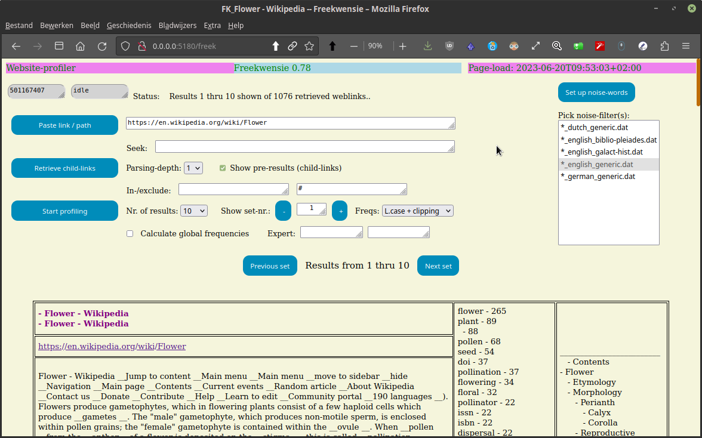
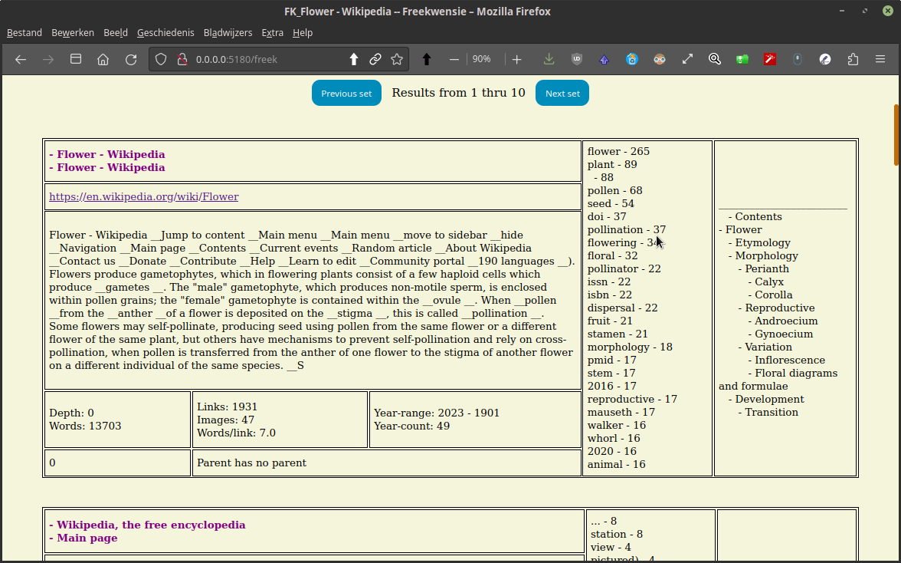
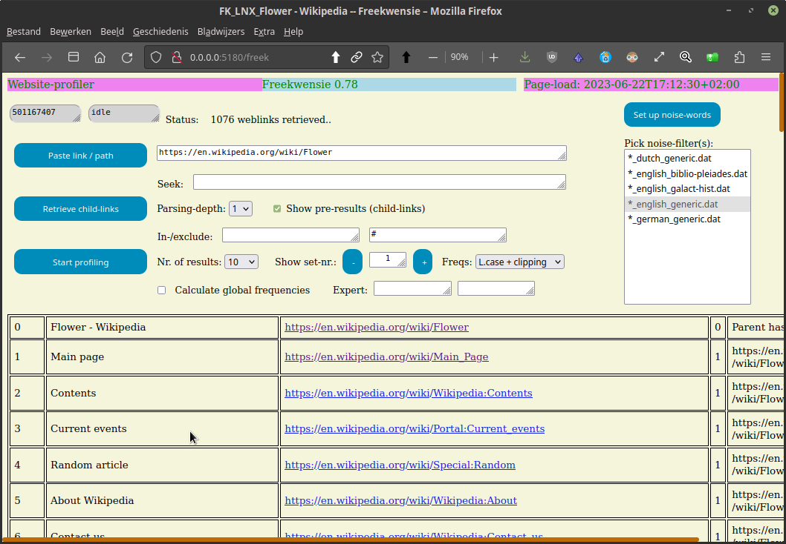
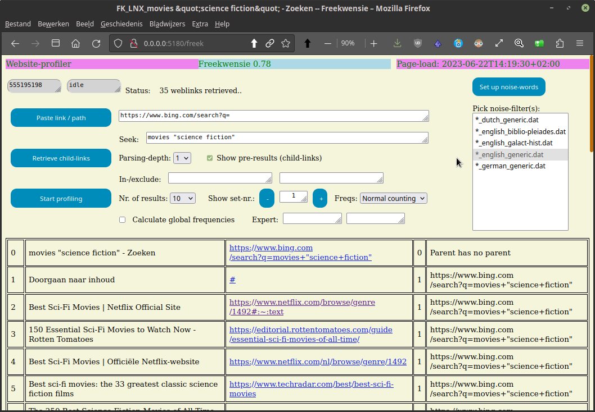
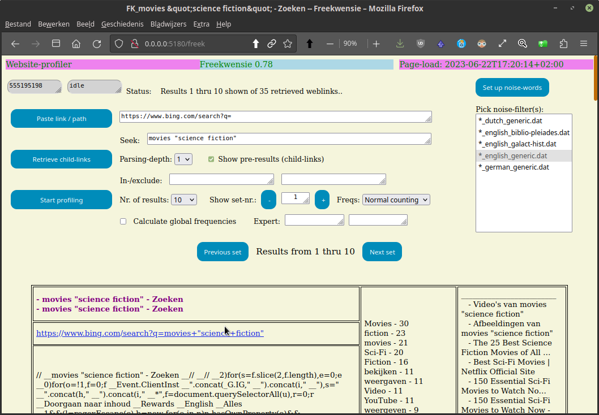
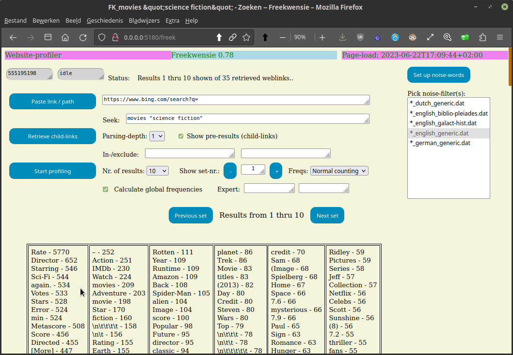
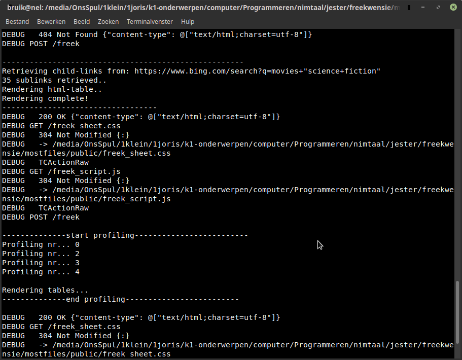
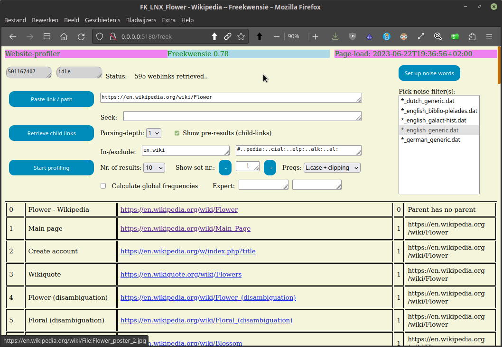

## Freekwensie - website-profiler

[See below for more screenshots](#more-screenshots)

[Go to downloadable releases for windows and linux](https://github.com/some-avail/freekwensie/releases "Downloads for Freekwensie")

[Go to the user-manual / wiki-section](https://github.com/some-avail/freekwensie/wiki)

FKW is a website-profiler that uses (aot) word-frequencies to get an idea of the content of the website, without the need of opening / entering it. FKW can profile all child-links of a parent-website, or even deeper. 

#### Description Freekwensie

FKW works (currently) in 3 steps:
1. Enter or paste the web-link.
2. Retrieve the child-links.
3. Render the web-profiles.

A website-profile contains:
- the title (from both parent and child)
- the link
- a short description of the first some hundred characters of text
- the following metrics:
  - parsing-depth
  - word-count
  - link-count
  - image-count
  - nr. of words per link
  - year-range (the latest year mentioned (maximally the current year) and the earliest year mentioned (minimally 1900 or so))
  - the nr. of year-numbers
  - the specificity of the text (= spec/ norm = nr. of non-noise-words / nr. of noise-words)
- the frequency-list; which words occur with the highest frequency (de-noised), a measure that describes the most important talking-points of the web-document.
- contents-list which is also generated from the website and is based on either:
  - the headers h1, h2, h3 etc. to generate a contents-list (default)
  - the expert-fields, if filled in. The contents between the first and second expert field is added to the contents-list.

Expert-fields enable knowledgable people to retrieve custom-information. Is explained in the wiki.

#### Usage as search-engine
Since search-results are a specific form of link-list, a provision has been made to be able to search the web. Firstly by entering the (parsable) search-engine (currently only Bing and Qwant are known to be parsable) and secondly search-terms can be entered in the Seek-box, which terms will then be concatenated with the search-engine web-address.

#### Additional program-info
- When FKW has been started from a terminal-window, one can see the progress-info there, especially concerning the progress of the profiled child-links, which can take a while.
- From 0.82 upward, some text-boxes hvae been upgraded to picklists; this goes for the paste-box and the expert-fields.
  * the picklists are populated from the respective files in the folder "lists".
  * list-options can be shown by clearing the box and then arrow-down to show and pick the options.

#### Installation-info for all operating systems
FKW is a web-app running in the browser. Furthermore, FWK should be ready-to-run, that is not needing additional package-installations except for the executable (which has been compiled for your specific OS) and the co-delivered data-files .

#### Installation on windows
- unzip the file, place it somewhere in your user-folder. (i myself have in my user-folder a subfolder "applications" in which i have placed ready-to-run apps).
- run the executable "freek_startup".
- add a permission to the firewall or other barriers that microsoft throws up against independent non-commercial developers.
- To access the web-server you just started (and thus start the app), type in your browser: http://localhost:5200/freek

#### Installation on Linux
- Just unpack, place it somewhere in your user-folder. 
- run the executable "freek_startup" as follows. 
  - Open a terminal, 
  - go to the folder which contains freek_startup
  - type: ./freek_startup
  - press enter
- To access the web-server you just started (and thus start the app), type in your browser: http://localhost:5200/freek

#### Installation by building (for developers)
Developers with knowledge of nim can download /clone the code and do the following:
- install external components:
	- nimclipboard-lib:
		> on linux mint 19 you need to install folowing packages:
		> libx11-xcb-dev and/or xcb
		> in either one of those exists xbc.h, which is needed.
	- moustachu
	- jester

Run the command:
nim c -d:ssl -d:release -r freek_startup.nim
which will compile the code to an executable, which will then be executed. 
In the developper-version I use the port-number 5180, which can be altered in freek_settings.conf to 5200, by moving the "#" one line.
The running program acts as a local  web-server, which can be connected to in a web-browser, by typing:
http://localhost:5200/freek_startup

### What's new in x.y?
[Open the whats-new-file](mostfiles/whatsnew_fkw.txt)
Or for programmers look at the commits.
[Commits-list](https://github.com/some-avail/freekwensie/commits/main)

#### Future plans:
- enable a pull-down list of favorites at the pasted-link box.
- optionally adding images.
- etc.

<a name="more-screenshots">More screenshots:</a>

Main screen, after profiling links from the wiki-page on flowers:

Wiki flower first profiled item (parent item):

But, before profiling, the links of the pasted website must be retrieved:

You can use Freekwensie as a search-engine, by retrieving from a parsable search-engine:

Then again you can profile the search-results to get a preview of the website:

Also you can profile with cumulative word-frequencies:

When the Freekwensie-webserver has been started from a terminal, the progress can be monitored there:

Include or exclude items from the retrieved sublinks.

