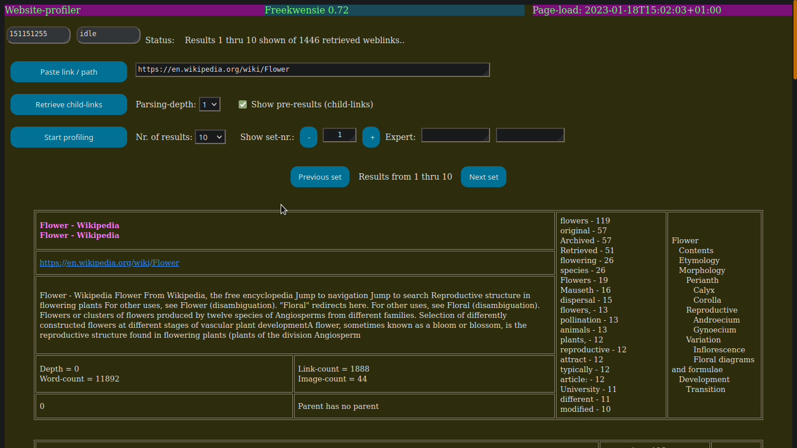
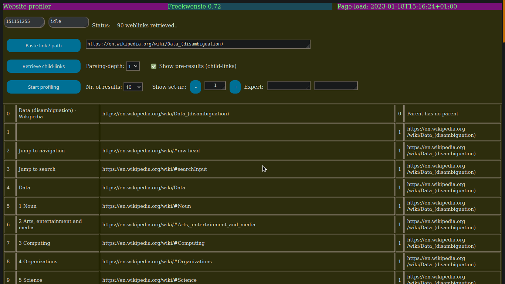

## Freekwensie

[See below for more screenshots](#more-screenshots)

[Go to downloadable releases for windows and linux](https://github.com/some-avail/freekwensie/releases "Downloads for Freekwensie")

FKW is a website-profiler that uses (aot) word-frequencies to get an idea of the content of the website, without the need of opening / entering it. FKW can profile all child-links of a parent-website, or even deeper. 

#### Description Freekwensie

FKW works (currently) in 3 steps:
1. Enter or paste the web-link.
2. Retrieve the child-links.
3. Render the web-profiles.

A website-profile contains:
- the title (from both parent and child)
- the link
- a short description of the first 600 characters of text
- metrics like:
  - parsing-depth
  - word-count
  - link-count
  - image-count
- the frequency-list; which words occur with the highest frequency, a measure that describes the most important talking-points of the web-document.
- contents-list which is also generated from the website.

Expert-fields enable knowledgable people to retrieve custom-information. Later explained in the wiki (forth-coming).

#### Installation-info for all operating systems
FKW is a web-app running in the browser. Furthermore, FWK should be ready-to-run, that is not needing additional package-installations except for the executable (which has been compiled for your specific OS) and the co-delivered data-files .

#### Installation on windows
- unzip the file, place it somewhere in your user-folder. (i myself have in my user-folder a subfolder "applications" in which i have placed ready-to-run apps).
- run the executable "freek_startup".
- add a permission to the firewall or other barriers that microsoft throws up against independent non-commercial developers.
- To access the web-server you just started (and thus start the app), type in your browser: http://localhost:5200/freek

#### Installation on Linux
- Just unpack, place it somewhere in your user-folder. 
- run the executable "freek_startup" as follows. 
  - Open a terminal, 
  - go to the folder which contains freek_startup
  - type: ./freek_startup
  - press enter
- To access the web-server you just started (and thus start the app), type in your browser: http://localhost:5200/freek

#### Installation by building (for developers)
Developers with knowledge of nim can download the code and do the following:
- install external components:
	- nimclipboard-lib:
		> on linux mint 19 you need to install folowing packages:
		> libx11-xcb-dev and/or xcb
		> in either one of those exists xbc.h, which is needed.
	- moustachu
	- jester

Run the command:
nim c -d:ssl -r flashread.nim
which will compile the code to an executable, which will then be executed. The running program then acts as a local  web-server, which can be invoked from a web-browser, by typing:
http://localhost:5050/flashread-form

#### Future plans ?
- adding database-support to enable document-selection based on word selections.
- improved noise-word-handling with help of a "noise-word-generator"
- optionally adding images.
- etc.

<a name="more-screenshots">More screenshots:</a>

